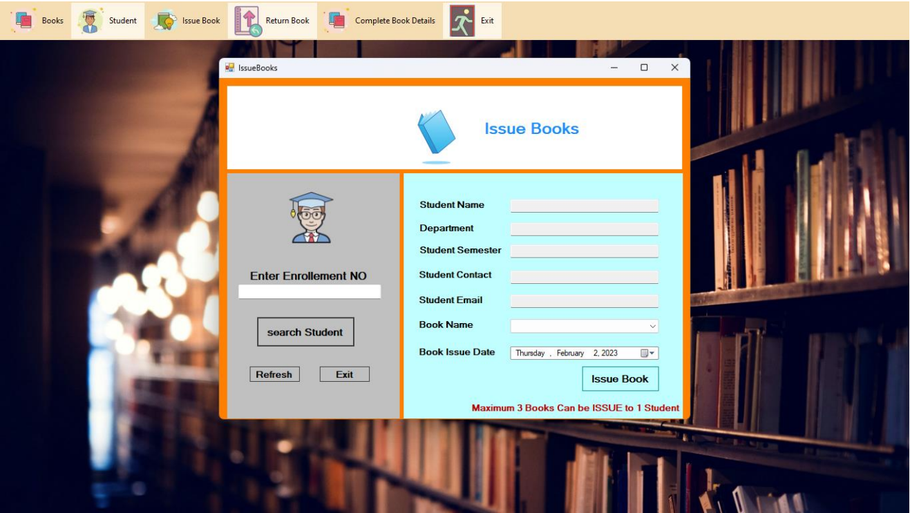

# 
AplicationCOST 31513 - README

  

Submission Date: 03/02/2023
###H.K.A.Kavishankh
University of Kelaniya - Library Management System

## Project Report

## Table of Contents
- [Introduction](#introduction)
- [Functional Requirements](#functional-requirements)
- [Tools Used](#tools-used)
- [Challenges Faced](#challenges-faced)
- [Lessons Learned](#lessons-learned)
- [Design of Web Pages](#design-of-web-pages)
- [Work Allocation](#work-allocation)

---

## Introduction
This project aims to design and develop a graphical user interface (GUI) for a Library Management System.

## Functional Requirements
The Library Management System should fulfill the following functional requirements:
- Ability to add new books
- Ability to view available books
- Ability to add new students
- Ability to view student list
- Ability to retrieve issued book details
- Ability to retrieve return book details

## Tools Used
The following tools were used in the design and development of the website:
- Visual Studio C#
- MySQL

## Challenges Faced
During the development process, the team encountered the following challenges:
- Establishing the database connection within the application
- Implementing data validation and exception handling

## Lessons Learned
Throughout the project, the team gained valuable knowledge and skills, including:
- Creating GUI using C#
- Applying form validations
- Implementing exception handling
- Connecting the application to a database

## Design of Web Pages
The GUI design comprises the following window forms:

### Logging Window Form

### Dashboard Window Form

### Add Book Window Form

### View Book Window Form

### Add Student Window Form

### View Student Window Form

### Issue Book Window Form

### Return Book Window Form

### Complete Book Details Window

---

  Built with ❤️ by the AplicationCOST
